  <!-- FUTURISTIC DEVELOPER DASHBOARD BANNER -->
  <picture>
    <source media="(prefers-color-scheme: dark)" srcset="./dark.svg">
    <source media="(prefers-color-scheme: light)" srcset="./light.svg">
    
  </picture>

   

  <!-- TYPING SUBTITLE -->
  

   

  <!-- SOCIAL BADGES -->
  

    &nbsp;
    &nbsp;
    &nbsp;
    
  

---

### 👤 About Me

Hello! I'm **Rida Taki**, a passionate **Full-Stack & Mobile Developer** based in Morocco. I hold a degree as a **Technicien Spécialisé en Développement Digital** from **OFPPT – ISTA Oued Zem**. 

I specialize in building robust backend systems with **Spring Boot** and developing beautiful cross-platform interfaces using **React** and **Flutter**. I focus on writing clean, maintainable, and high-performance code.

- 🔭 **Current Status:** Open to Full-Stack & Backend Internship opportunities.
- 🎓 **Education:** Technicien Spécialisé en Développement Digital (OFPPT - ISTA Oued Zem).
- 💬 **Ask me about:** Java, Spring Security, Flutter, SQLite, & RESTful Microservices.
- ⚡ **Fun fact:** I love designing UI mockups in Figma before translating them into fully functional, production-ready code.

---

### 💻 Tech Stack

| 🛠️ Languages & Core | 🚀 Frontend & Mobile | ⚙️ Backend & APIs |
| :--- | :--- | :--- |
|  |  |  |

| 🔧 DevOps & Workflow Tools |
| :--- |
|  |

---

### 🚀 Featured Projects

<table width="100%">
  <!-- Project 1 & 2 Side-by-Side -->
  <tr>
    <td width="50%" valign="top" style="border: 1px solid #1E293B; border-radius: 12px; padding: 16px;">
      <h3 align="center">🏥 HealthCare+</h3>
      
<i>Medical Management Enterprise Platform</i>

      

        
        
        
        
        
      

      <ul>
        <li><b>Role-Based Access Control:</b> Secure authorization paths for Administrators, Doctors, and Patients.</li>
        <li><b>Medical Portal:</b> Complete appointment bookings, history tracking, and patient records system.</li>
        <li><b>Deployment ready:</b> Containerized with Docker and documented with Postman REST collections.</li>
      </ul>
      

        <a href="https://github.com/Rida1019-taki/HealthCare-Plus"><b>View Repository ↗</b></a>
      

    </td>
    <td width="50%" valign="top" style="border: 1px solid #1E293B; border-radius: 12px; padding: 16px;">
      <h3 align="center">🚗 Car Rental Marketplace</h3>
      
<i>Interactive Vehicle Booking Portal</i>

      

        
        
        
        
      

      <ul>
        <li><b>Marketplace Catalog:</b> Search, filter, and rent vehicles with dynamic availability scheduling.</li>
        <li><b>Secure Bookings:</b> Implements JWT verification, token expiration, and secure payment simulation.</li>
        <li><b>Full-Stack Integration:</b> Seamless state communication via Axios and reactive UI updates.</li>
      </ul>
      

        <a href="https://github.com/Rida1019-taki/car-rental-marketplace"><b>View Repository ↗</b></a>
      

    </td>
  </tr>
  <!-- Project 3 Full Width -->
  <tr>
    <td colspan="2" valign="top" style="border: 1px solid #1E293B; border-radius: 12px; padding: 16px;">
      <h3 align="center">📱 Mobile Applications Portfolio</h3>
      
<i>Native & Cross-Platform Android/iOS Development</i>

      

        
        
        
        
      

      <ul>
        <li><b>Kotlin Native:</b> Direct hardware integrations, local databases, and custom views using Android SDK.</li>
        <li><b>Flutter Apps:</b> Cross-platform delivery with responsive screens and BLoC / Provider state management.</li>
        <li><b>Offline Caching & Realtime Sync:</b> Integrated local SQLite stores synced to remote Firebase tables.</li>
      </ul>
      

        <a href="https://github.com/Rida1019-taki?tab=repositories&q=mobile"><b>Browse Mobile Repositories ↗</b></a>
      

    </td>
  </tr>
</table>

---

### 📊 GitHub Analytics

<!-- Note to user: If hosting your own github-readme-stats instance on Vercel, replace "github-readme-stats.vercel.app" with your deployment URL -->

  <table border="0" cellpadding="0" cellspacing="0" width="100%">
    <tr>
      <td valign="top" width="50%" align="center">
        
      </td>
      <td valign="top" width="50%" align="center">
        
      </td>
    </tr>
    <tr>
      <td colspan="2" align="center" valign="top">
         
        
      </td>
    </tr>
  </table>

---

### 🐍 Contribution Activity

  <picture>
    <source media="(prefers-color-scheme: dark)" srcset="https://raw.githubusercontent.com/Rida1019-taki/Rida1019-taki/output/github-contribution-grid-snake-dark.svg">
    <source media="(prefers-color-scheme: light)" srcset="https://raw.githubusercontent.com/Rida1019-taki/Rida1019-taki/output/github-contribution-grid-snake.svg">
    
  </picture>

---

### 🎯 Current Focus

*   **Microservice Architectures:** Decoupling Spring Boot monoliths into Docker-orchestrated microservices.
*   **API Security:** Hardening API gateways with Spring Security, OAuth2, and JSON Web Tokens.
*   **State Management:** Refining state workflows in React (Redux toolkit) and Flutter (BLoC).
*   **Academic Application:** Seeking a dynamic internship where I can solve real-world problems.

---

### ✉️ Get In Touch

If you are looking for an enthusiastic, fast-learning Full-Stack or Backend Intern, I'd love to connect!

*   💼 **LinkedIn:** [linkedin.com/in/rida-taki](https://www.linkedin.com/in/rida-taki-bb44a8350/)
*   🌐 **Portfolio:** [rida-taki.vercel.app](https://rida-taki.vercel.app)
*   ✉️ **Email:** [takirida72@gmail.com](mailto:takirida72@gmail.com)
*   📸 **Instagram:** [@rida_taki_10](https://instagram.com/rida_taki_10)

---

<!-- DYNAMIC THEME-SENSITIVE FOOTER -->

  <picture>
    <source media="(prefers-color-scheme: dark)" srcset="./footer-dark.svg">
    <source media="(prefers-color-scheme: light)" srcset="./footer-light.svg">
    
  </picture>

